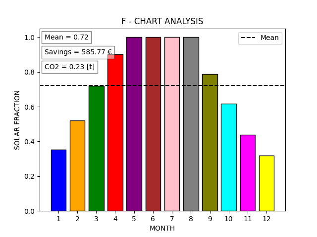

<!DOCTYPE html>
<html>

<head>
  <meta charset="utf-8">
  <meta name="viewport" content="width=device-width, initial-scale=1.0">
  <link rel="stylesheet" href="https://stackedit.io/style.css" />
</head>

<body class="stackedit">
  
<h1 id="integrated-collector-storage-with-movable-insulation-layer">Integrated Collector Storage with Movable Insulation Layer</h1>
<h2 id="overview">Overview</h2>

This project presents an F-chart analysis tool, a graphical method designed to calculate the hourly energy performance of solar thermal collectors. It enables users to determine the proportion of Domestic Hot Water (DHW) needs that can be met by solar energy over a year. This tool is particularly useful for assessing annual energy savings and CO2 reductions based on the type of energy source used in DHW production.

<h2 id="project-details">Project Details</h2>

This project implements the F-Chart methodology to enable users to evaluate their solar thermal system’s performance throughout the year. Utilizing the F-chart method, it calculates the percentage of Domestic Hot Water (DHW) needs, set at 45 liters per person for this simulation, that can be met using solar energy annually. Additionally, it provides insights into potential annual energy savings and CO2 emissions reduction based on the energy source used for DHW production. The tool allows for personalized analysis by entering custom values, guided by the provided default data.

For a comprehensive overview,  please visit the project’s dedicated webpage:

🔗 <a href="https://serhanyuzbey.com/project_2">F-Chart Analysis</a>

<h2 id="features">Features</h2>
<ul>
<li><strong>Customizable Inputs</strong>: Insert your values for a personalized analysis, with guidance from default values.</li>
<li><strong>Annual Performance Metrics</strong>: Calculate the percentage of DHW needs met by solar energy annually.</li>
<li><strong>Energy Savings and CO2 Reduction</strong>: Evaluate the environmental impact depending on the primary energy source for DHW generation.</li>
</ul>
<h2 id="how-to-use">How to Use</h2>

To enhance user experience, this project comes with pre-set default values for a monthly solar-thermal analysis of a solar thermal collector. These defaults act as a reference, enabling you to efficiently evaluate your design in different geographical contexts.

<h2 id="results-and-interpretation">Results and Interpretation</h2>

After entering your data and initiating the simulation, the application generates a month-solar fraction graph. This graph displays the percentage of Domestic Hot Water (DHW) needs met by the solar thermal collector over the year. The visualization provides insights into average solar fraction values, enabling the calculation of savings from replacing primary energy sources with solar energy. Additionally, it highlights the environmental impact of substituting conventional energy sources with solar alternatives. 

<h2 id="contact">Contact</h2>

Should you have any questions or suggestions about the project, feel free to reach out to me:

<ul>
<li>Email: <a href="mailto:serhanyuzbey@gmail.com">serhanyuzbey@gmail.com</a></li>
<li>Social Media: <a href="www.linkedin.com/in/serhanyuzbey">LinkedIn</a></li>
</ul>
<h2 id="acknowledgements">Acknowledgements</h2>

I would like to thank my advisors, peers, and all who supported me throughout this project.

</body>

</html>
